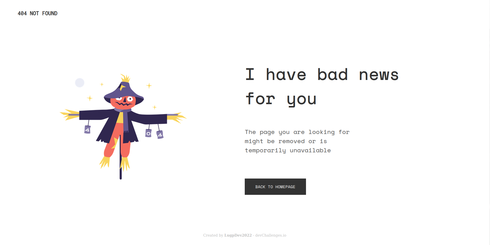

<!-- Please update value in the {}  -->

<h1 align="center">404 Not Found</h1>

   Solution for a challenge from  <a href="http://devchallenges.io" target="_blank">Devchallenges.io</a>.

  <h3>
    <a href="https://lugpdev2022-404.netlify.app/">
      Demo
    </a>
     | 
    <a href="https://github.com/LugpDev2022/404-not-found">
      Solution
    </a>
     | 
    <a href="https://devchallenges.io/challenges/wBunSb7FPrIepJZAg0sY">
      Challenge
    </a>
  </h3>

<!-- TABLE OF CONTENTS -->

## Table of Contents

- [Overview](#overview)
  - [Built With](#built-with)
- [Features](#features)
- [Acknowledgements](#acknowledgements)
- [Contact](#contact)

<!-- OVERVIEW -->

## Overview

- Where can I see your demo?
  - You can see it here: https://lugpdev2022-404.netlify.app/
- What was your experience?
  - I enjoyed doing this project because it wasn't very difficut
- What have you learned/improved?
  - I improved my experience working with react + sass

### Built With

<!-- This section should list any major frameworks that you built your project using. Here are a few examples.-->

- [React](https://reactjs.org/)
- [Sass](https://sass-lang.com/)

## Features

<!-- List the features of your application or follow the template. Don't share the figma file here :) -->

This application/site was created as a submission to a [DevChallenges](https://devchallenges.io/challenges) challenge. The [challenge](https://devchallenges.io/challenges/wBunSb7FPrIepJZAg0sY) was to build an application to complete the given user stories.

- I can see a page following the given design

## Acknowledgements

<!-- This section should list any articles or add-ons/plugins that helps you to complete the project. This is optional but it will help you in the future. For exmpale -->

- [Node.js](https://nodejs.org/)
- [Yarn](https://yarnpkg.com/)
- [Prettier](https://prettier.io/)

## Contact

- GitHub [@LugpDev2022](https://github.com/LugpDev2022)
